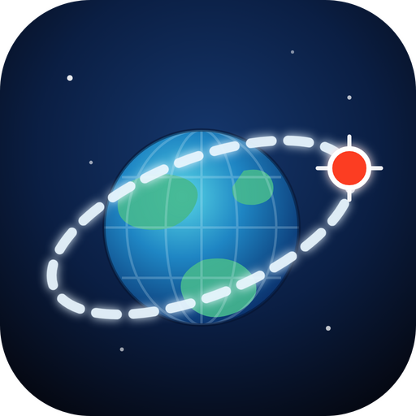
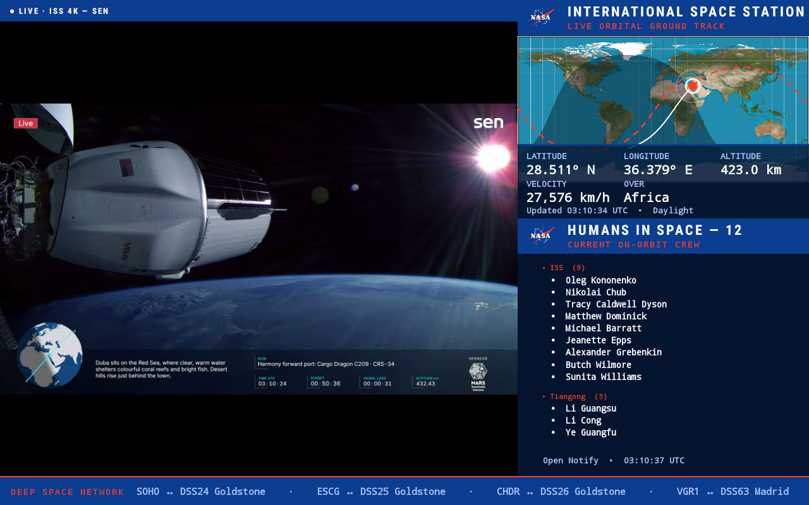
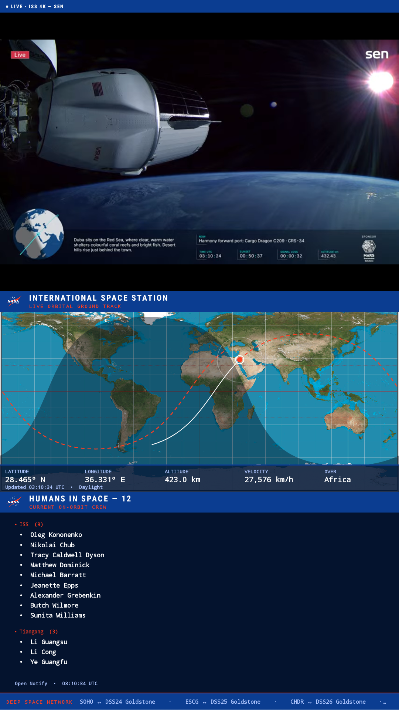

# ISS Tracker for Meta Portal

A kiosk-style, NASA-branded **International Space Station dashboard** for a
sideloaded **Meta Portal** (Android, no Google services). Inspired by
[filbot/iss-tracker](https://github.com/filbot/iss-tracker) (a Raspberry Pi /
Python project) — this is a native Android re-imagining: a **live video feed from
the ISS**, a **live orbital ground track**, the **people-in-space roster**, plus
space-weather, launch, Deep Space Network and asteroid widgets — all from free,
**no-API-key** sources.

|  Landscape (2019 Portal, 1280×800)  |  Portrait (Portal+, 1920×1080)  |
|:---:|:---:|
|  |  |

> **Making something for the Meta Portal?** Tag your repo with the
> [`meta-portal`](https://github.com/topics/meta-portal) GitHub topic so we can all
> find each other's sideloadable Portal apps in one place.

## What it shows

- **Live ISS video (hero panel)** — [Sen](https://www.sen.com/)'s real 4K cameras on
  the ISS (the SpaceTV-1 payload), streamed from YouTube. Dark when the station is on
  the night side of Earth — which the map's terminator explains.
- **Live orbital ground track** — the ISS on an equirectangular world map with the
  predicted ground-track path (solid where it's been, dashed NASA-red ahead), a
  visibility-footprint circle, and a shaded **day/night terminator**.
- **Telemetry HUD** — latitude, longitude, altitude, velocity, a coarse offline
  "over region" label, and day/night visibility.
- **Rotating widget panel** — cycles **Humans in Space** (crew by spacecraft) and
  **Space Weather** (NOAA Kp index, solar wind, X-ray flare class + the live NASA
  SDO Sun image). Tap to advance.
- **Footer ticker** — rotates the **next launch** (live T- countdown), the **Deep
  Space Network** (which spacecraft is talking to which antenna right now), and the
  next **asteroid close approach**.
- NASA-blue title bars with the meatball insignia; fullscreen, screen-kept-on, and
  **responsive** to orientation (landscape side-by-side / portrait stacked) and to
  screen size.

## Data sources (all free, no API key)

| Feed | Source |
|------|--------|
| ISS position + telemetry (+ sub-solar point) | `api.wheretheiss.at` |
| People in space | `api.open-notify.org/astros.json` |
| Live ISS video | [Sen](https://www.sen.com/live) on YouTube (`@Sen`) |
| Next launch | The Space Devs [Launch Library 2](https://ll.thespacedevs.com/) |
| Space weather (Kp, solar wind, X-ray) | [NOAA SWPC](https://services.swpc.noaa.gov/) |
| Deep Space Network now | `eyes.nasa.gov/dsn/data/dsn.xml` |
| Asteroid close approach | [JPL CAD API](https://ssd-api.jpl.nasa.gov/) |
| Sun image | [NASA SDO](https://sdo.gsfc.nasa.gov/) 193Å |

No Google Play Services, Maps SDK, or login required — everything is
`HttpURLConnection` + `org.json` + `Canvas`, except the video, which uses a `WebView`.

## Install it on your Portal

> **You need a Portal that allows sideloading / `adb`** (a developer/unlocked unit, or
> one you've put into debugging mode). Retail Portals are locked down. Tested on the
> 2018 **Portal+** (Android 9) and the 2019 10″ **Portal** (Android 10), both
> Google-services-free. `minSdk 24`, `targetSdk 34`.

### 1. Get `adb` talking to the Portal

1. Install Android **platform-tools** (`adb`) on your computer.
2. Enable **Developer options → USB debugging** on the Portal, plug it in, accept the
   prompt, and confirm it shows up:
   ```bash
   adb devices
   ```
   On Linux you may need a udev rule for Meta's USB vendor id (`2ec6`):
   ```
   # /etc/udev/rules.d/51-android.rules
   SUBSYSTEM=="usb", ATTR{idVendor}=="2ec6", MODE="0660", GROUP="plugdev"
   ```
3. *(Optional)* go wireless so it can sit on a shelf:
   ```bash
   adb tcpip 5555
   adb connect <portal-ip>:5555
   ```

### 2a. Install the prebuilt APK (easiest)

Grab `space-portal.apk` from the [Releases](../../releases) page, then:

```bash
adb install -r space-portal.apk
adb shell monkey -p com.portal.isstracker -c android.intent.category.LAUNCHER 1
```

### 2b. …or build from source

Needs **JDK 17+** and the **Android SDK** (platform-34, build-tools 34). Point Gradle
at your SDK (either set `$ANDROID_HOME`, or create `local.properties` with
`sdk.dir=/path/to/Android/Sdk`), then:

```bash
./gradlew assembleDebug

# one-shot build → install → launch (auto-detects adb; -s targets a device)
./deploy.sh --build
./deploy.sh -s <portal-ip>:5555 --build
```

### 3. Run it as a wall display

- The app keeps the screen on and goes fullscreen/immersive on its own. To force the
  panel to stay awake regardless: `adb shell svc power stayon true`.
- **Rotate the Portal** and the layout follows (portrait stacks the panels; landscape
  puts them side by side).
- **Tap the bottom-right panel** to flip between Humans in Space and Space Weather; the
  footer ticker rotates on its own.

## How the live video works (Meta Portal WebView notes)

Embedding the ISS stream took some fighting with the Portal's **forked WebView**
(`com.facebook.portal.webview`). In case it helps anyone else:

- **NASA's own stream blocks embedding** (YouTube error 150). **Sen allows embeds**, so
  that's the source; its current live video id is **scraped at startup** from
  `youtube.com/@Sen/live`, so the feed survives stream restarts.
- YouTube's **mobile player throws a non-recoverable MSE/DRM error** in this WebView
  fork → force a **desktop Chrome user-agent** so it serves the desktop player.
- The player needs a **valid embedding origin + Referer**: a `data:`-URL iframe has a
  null origin (error 152) and a top-level load sends no referer (error 150). The fix is
  a **tiny localhost HTTP server** (`FeedView`) that serves the iframe page, giving it a
  real `http://127.0.0.1` origin. The video then plays on the **Qualcomm hardware VP9
  decoder**.

## Project layout

```
app/src/main/java/com/portal/isstracker/
  MainActivity.java   kiosk lifecycle, polling, orientation-aware layout, panel rotation
  IssApi.java         clients: wheretheiss.at, open-notify, Launch Library 2, NOAA, DSN, JPL
  FeedView.java       live ISS video (WebView + localhost embed server, live-id scrape)
  TrackerView.java    world map + ground track + day/night terminator + adaptive HUD
  OrbitTrack.java     circular-orbit model for the ground-track path
  CrewView.java       people-in-space roster (auto-scales to fit)
  WeatherView.java    space weather + live SDO Sun image
  Ticker.java         rotating footer: launch countdown / DSN / asteroid
  GeoRegion.java      offline bounding-box "over region" classifier
app/src/main/assets/   world.jpg (equirectangular map), nasa.png (NASA insignia)
```

## Credits & license

- Concept: [filbot/iss-tracker](https://github.com/filbot/iss-tracker)
- Live ISS video: [Sen](https://www.sen.com/) (SpaceTV-1 cameras aboard the ISS)
- Data: [Where the ISS at?](https://wheretheiss.at/), [Open Notify](http://open-notify.org/),
  [The Space Devs](https://thespacedevs.com/), [NOAA SWPC](https://www.swpc.noaa.gov/),
  [NASA JPL](https://ssd-api.jpl.nasa.gov/), [NASA SDO](https://sdo.gsfc.nasa.gov/), [NASA DSN](https://eyes.nasa.gov/dsn/)
- World map: public-domain equirectangular Earth (via Wikimedia Commons)
- The NASA insignia is used per [NASA's media guidelines](https://www.nasa.gov/nasa-brand-center/images-and-media/)
  for this non-commercial fan project and does **not** imply NASA endorsement.

Code is released under the [MIT License](LICENSE). This is an unofficial hobby project,
not affiliated with NASA, Meta, or Sen.
